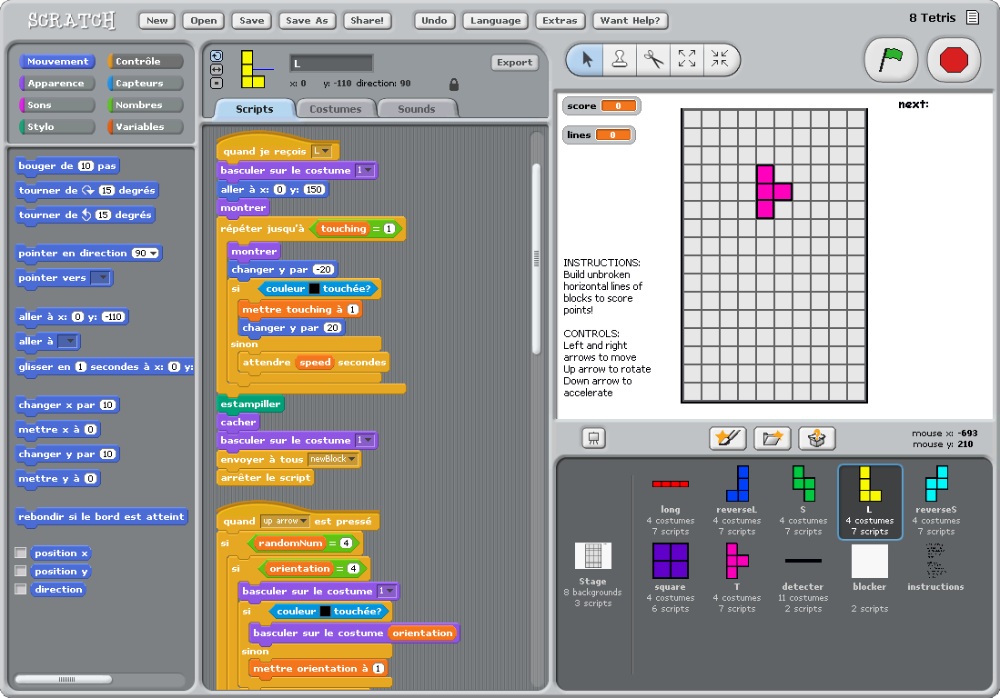
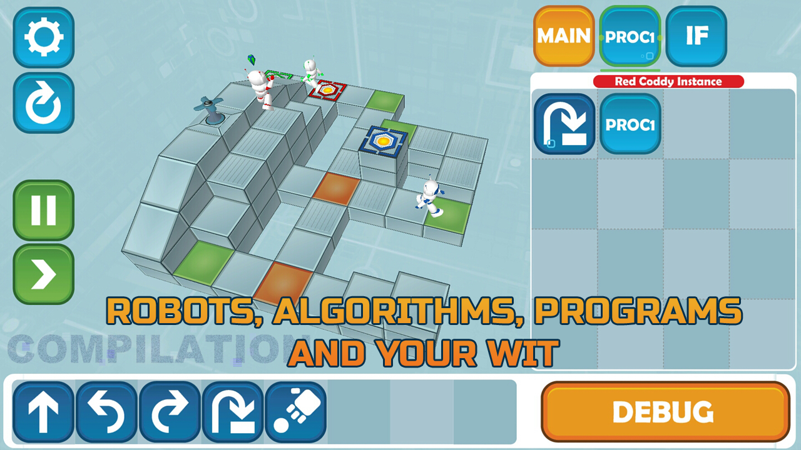
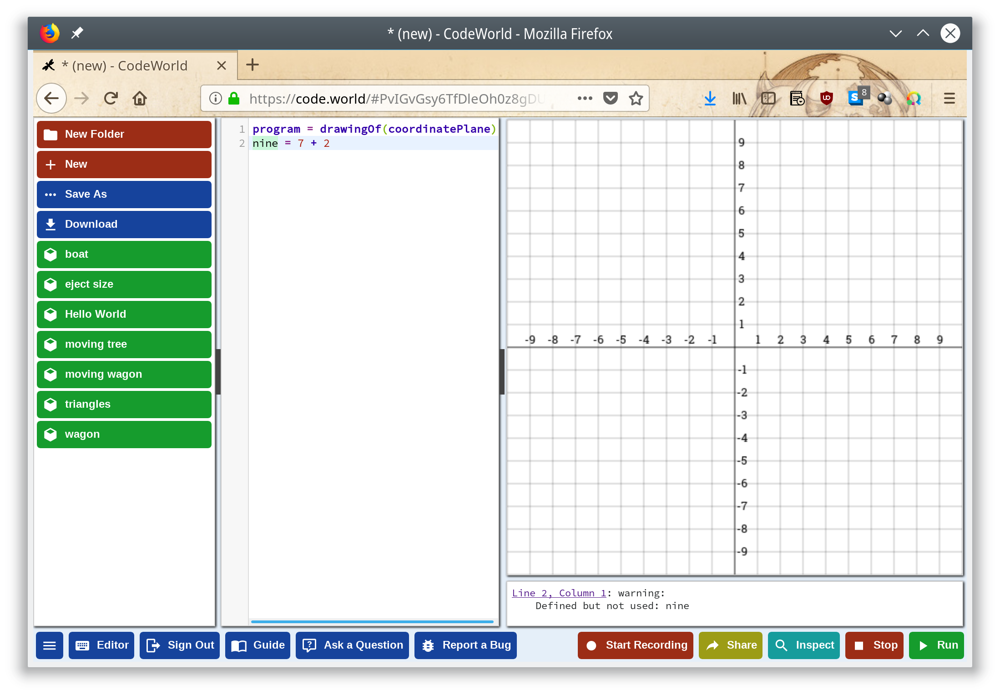
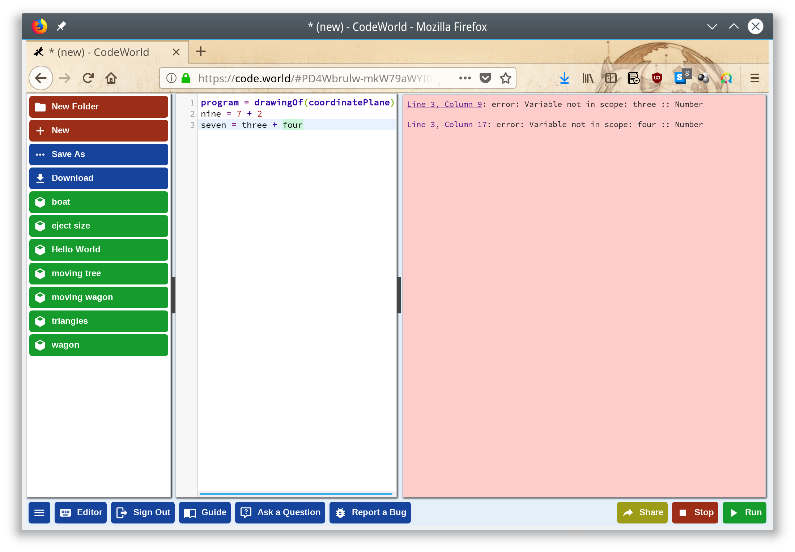
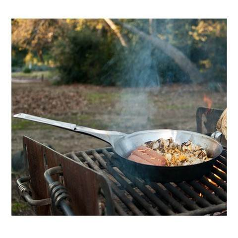
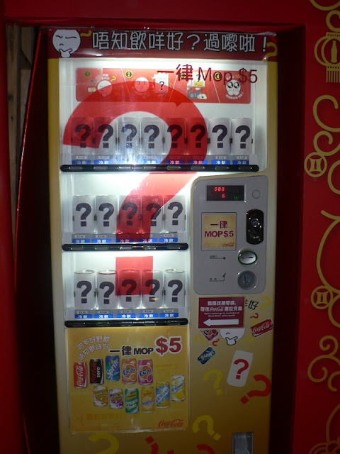
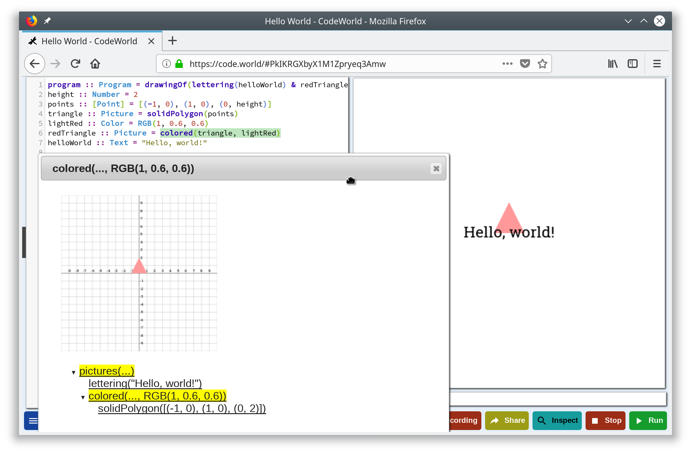
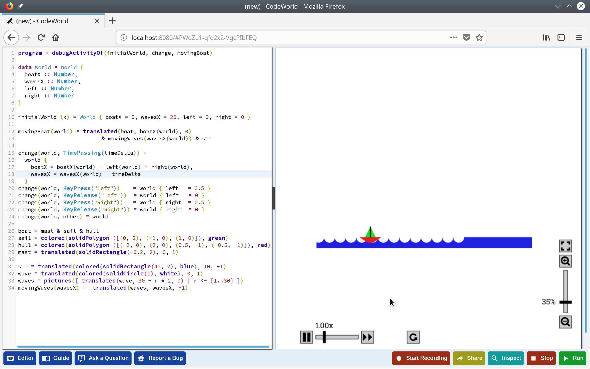
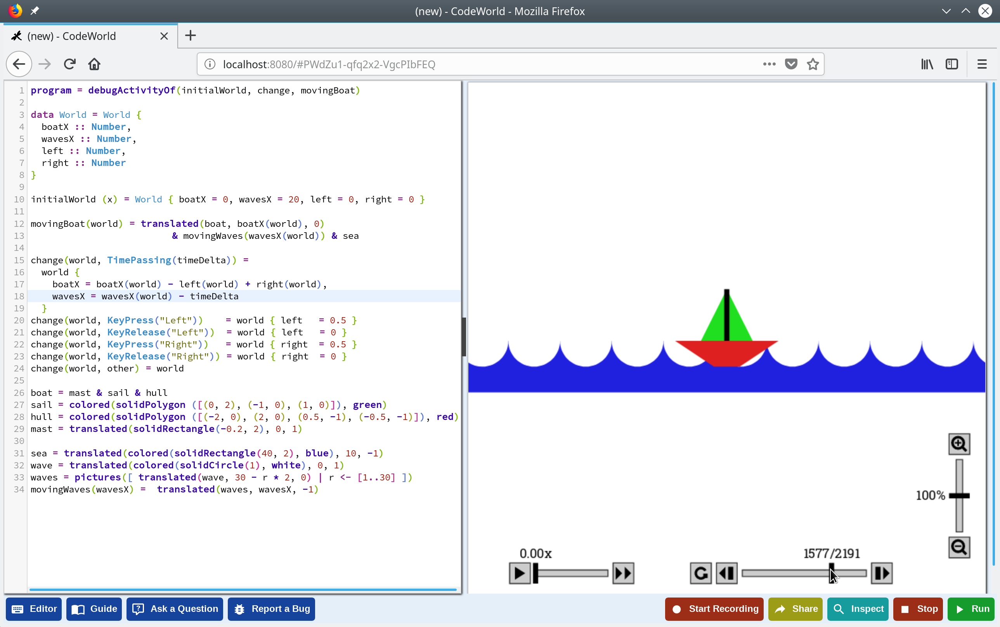
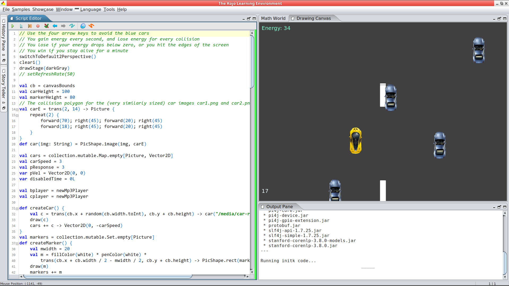

// Rendering : make
// Serve : make server
//
// Useful links : https://www.seas.upenn.edu/~cis194/fall16/lectures/01-intro.html


:revealjs_theme: serif
:source-highlighter: highlightjs
:stem: asciidoctor-mathematical

= CodeWorld

[NOTE.speaker]
--
Une plateforme d'initiation à la programmation informatique
basée sur la programmation fonctionnelle, dans laquelle il
est possible de créer des dessins.
(un peu comme scratch)
--

== whoami

* développeur {wj}backend {wj}@ {wj}Lizeo
* @pulsati0n

[NOTE.speaker]
--
Le comparateur de prix rezulteo est un comparateur de pneus en ligne 
qui permet de trouver des pneus qui vont à votre auto comme des gants.
Il prend en compte votre style de conduite via entre autre de l'analyse
du langage naturel.

Cependant, Lizeo est bien plus que ça : la partie b2b propose des offres
techniques et commerciales d'analyse de données, en particulier pour les 
pneus.
--

== De quoi allons-nous parler? 

* Les outils "traditionnels"
* Une approche différente
* utiliser CodeWorld
* Comment ça fonctionne

[NOTE.speaker]
--
Approche différente dans le sens où on utilise de la programmation
fonctionnelle, avec des notions simples (pas de monades par exemple).
--

== Les outils "traditionnels"

=== Il y a très, très longtemps

// possibilité d'utiliser http://robhagemans.github.io/pcbasic/

```basic
5 CLS
30 INPUT "How many stars do you want?"; NUMBER
40 FOR I = 1 TO NUMBER
50 STAR$ = STAR$ + "*"
55 NEXT I
60 PRINT STAR$
70 INPUT "Do you want more stars "; STAR$
80 IF LEN(STAR$) = 0 THEN GOTO 70
90 STAR$ = LEFT$(STAR$, 1)
100 IF (STAR$ = "Y") OR (STAR$ = "y") THEN GOTO 30
```

[NOTE.speaker]
--
Cet exemple est issu de Wikipedia.

Il représente une certaine vision de la programmation : chaque
ligne est exécutée l'une après l'autre dans l'ordre.

Les numéros de ligne mettent en avant le côté séquentiel des instructions.
`STAR$` est une variable qui est réassignée avec un contenu qui n'a
rien à voir avec ce qu'elle doit contenir ; l'exécution du programme
dépend de son état.
--

=== Aujourd'hui



[NOTE.speaker]
--
Scratch est un environnement d'initiation au code bien répandu. On
peut observer ici que les instructions sont ici aussi exécutées
de façon séquentielle à l'intérieur du premier repeat, et que la 
variable `touching` est écrasée.
--

=== Aujourd'hui



// Exemple : scratch
// https://www.gameseducatekids.com/games/coddy_world_on_algorithm 

[NOTE.speaker]
--
Même si l'instruction `goto` a quelque part été remplacée dans Coddy par
des téléporteurs, le principe reste le même (l'exécution séquentielle
d'une série d'instructions, le robot représentant un pointeur
d'instruction).

Si en effet un ordinateur exécute le code de cette façon, les
langages aujourd'hui ont évolué. Plutôt que d'adapter les
humains aux machines, pourquoi ne pas inverser les rôles
et adapter la machine à un langage plus humain?
--

=== Une approche différente

 * S'appuyer sur le paradigme fonctionnel 
 * Évaluer des fonctions plutôt qu'exécuter des séquences d'instructions
 * Éviter les données mutables

[NOTE.speaker]
--
Les enfants étant des humains et pas des machines, il est possible 
d'envisager une approche différente: au lieu de tenter de penser comme
des machines, tâche pour laquelle elles sont sans aucun doute bien
meilleures que nous, nous allons exprimer nos programmes avec quelque
chose de plus humain. Les mathématiques algébriques sont en effet un bon 
outil de modélisation utilisé depuis l'antiquité.
--


// === Why mathematics
// Mathematics is the body of knowledge justified by deductive reasoning 
// about abstract structures, starting from axioms and definitions.
// 
// --
// Indeed, one of the authors' will is to bring some fun to maths,
// as today there are no really funny means to learn maths - 
// multiplications tables, etc are not indeed. 
// 
// Mathematics can be used to describe the natural world. 
// --

//  * Bring some fun to math

// [NOTE.speaker]
// --
// The original focus of code.world is math - 
// Much disciplines can be practiced with some fun, except mathematics. Why not?
// Why staying with multiplication tables?...
// --

// === Creative maths


// == Qu'est-ce-que c'est

// === Une plateforme pour apprendre à coder

// === Une question de principes
=== CodeWorld, c'est quoi

* Origine : Haskell for kids
* Des maths :
** Sans langage intermédiaire
** Créatives


[NOTE.speaker]
--
L'auteur principal de CodeWorld est Chris Smith, ingénieur de développement
chez Google. Il est aussi professeur de mathématiques et d'informatique
volontaire à ses heures perdues. 

L'une des volontés qu'il affiche - en particulier lors des différentes
présentations qu'il a données - est de fournir un outil
qui rende les mathématiques plus accessibles et plus sympathiques aux 
enfants.

En effet, apprendre des tables de multiplications n'est pas particulièrement
agréable ny sympa - ni créatif.

Il insiste aussi sur l'expressivité : certains jeux comme Coddy proposent
de résoudre des puzzles, mais laissent peu de choix.
--

=== Pourquoi Haskell
 
[stem]
++++
f(x) = {(x^2|x<0),(x^3|x>=0):}
++++

```cpp
// En C
double f(double x) {
  if (x < 0) return pow(x, 2);
  else return pow(x, 3);
}
```

```haskell 
-- En Haskell
f(x) | x <  0  = x^2
     | x >= 0  = x^3
```

[NOTE.speaker]
--
Voici un exemple de notation mathématique. L'équivalent en C demande
une transcription ; Haskell reste de façon générale le plus proche 
des maths. (d'autres exemples sont disponibles dans les présentations
de Chris Smith)
--

=== Nous ne sommes pas (encore) des machines

* Une échelle de 0 à 10 plutôt que des pixels
* Des définitions non séquentielles (dictionnaire)
* Origine des coordonnées au centre de l'écran
* X est l'axe horizontal

[NOTE.speaker]
--
Le nombre de pixels n'est pas évident à gérer pour de jeunes enfants.
Dans un dictionnaire, les mots ne sont pas définis dans l'ordre
de leur utilisation : on peut utiliser un autre mot qu'il soit situé
avant ou après.
Enfin, pour mettre en avant le fait qu'il n'y a pas forcément d'ordre
séquentiel, le dernier élément est celui qui est affiché le plus en 
dessous.

```haskell
program = drawingOf(coordinatePlane)
```

// Some of these implementation particularities prove here that
//we are dealing with something different.
// Why not take this opportunity to learn floating numbers?
--


// === The coordinate plane
// image::images/codeworld-coordinate-plane.png[coordinate plane]
// [NOTE.speaker]
// --
// The CodeWorld coordinate plane is easier to work with for children.
// --

== Utiliser CodeWorld

// Image avec les différents panneaux : 
// * Editeur de texte (expliciter les possibilités)
// Canevas
// Fenêtre d'erreurs / warnings

=== À quoi ça ressemble



[NOTE.speaker]
--
Il y a trois parties principales :

* Sur la gauche, un éditeur de texte qui permet de rentrer du code.
* En haut à droite, un canevas qui affiche le résultat de l'exécution
du programme.
* En bas à droite, les erreurs et informations.

Un autre panneau propose de l'aide (les boutons bleus). Il est 
possible de sauvegarder des programmes, de les partager, et 
d'enregistrer des vidéos.

Des formes géométriques basiques sont manipulées et transformées,
afin de faire des dessins.
--

=== À quoi ça ressemble



=== Formes géométriques

* `circle(Number)`
* `rectangle(Number, Number)`
* `polygon([Point])`
* Formes pleines

[NOTE.speaker]
--
Il y a bien plus de formes disponibles, mais celles-ci suffiront pour
faire des dessins basiques.
// TODO: shapes example?
// TODO: travailler les polygones.
--

=== Transformations

* Ajouter de la couleur
* Déplacer
* Faire pivoter
* Agrandir / réduire 
* Combiner (`&`)

[NOTE.speaker]
--

* colored :: (Picture, Color) -> Picture
* translated :: (Picture, Number, Number) -> Picture
* rotated :: (Picture, Number) -> Picture 
* dilated :: (Picture, Number) -> Picture

Il y a quelques synonymes (par exemple, les écritures américaines et
anglaises de coloured). Cependant, il n'existe pas à ce jour de version
francisée. 
--

// TODO: === Example

=== Quelques notions

* Expressions
* Définitions
* Fonctions
* Types

[NOTE.speaker]
--
Voici quelques notions basiques que nous allons pouvoir utiliser
avec CodeWorld. Nous allons les décrire plus précisément dans les
diapositives qui vont suivre.
--

=== Expression

Une combinaison de symboles:
```haskell
7 + 2
x + 1
```

=== Définition

Donner un nom à une expression:
```haskell
nine = 7 + 2
increment(x) = x + 1
```

[NOTE.speaker]
--
C'est de cette façon que les fonctions sont définies : elles sont 
citoyennes à part entière du langage. 

Une fonction prend un ou plusieurs paramètres en entrée. Substituer
ces paramètres par les valeurs transmises lors de sont appel permet
de l'appliquer.
--

=== Ceci est une poêle



[NOTE.speaker]
--
On peut voir une fonction comme une poêle à frire.
En effet, le nom de la fonction correspondrait au
manche de la poêle et les paramètres aux ingrédients.
Faites chauffer à feu doux, et au bout de quelques
temps on obtient le résultat : une délicieuse
omelette :p
--

=== La machine mystère



[NOTE.speaker]
--
Une autre possibilité de petit jeu est de demander
aux enfants de deviner une fonction qu'on a imaginée :
à chaque "entrée", on lui donne le résultat. 
On peut même introduire la notion de type: par exemple, 
`f(x) = x * 2` ne pourrait pas prendre `abricot` en
entrée.
--

=== Type

Qu'est-ce qui est manipulé? De quoi on parle?

```haskell
five :: Number = 5

alphaOmega :: Text
alphaOmega = "αω"

increment :: Number -> Number
increment(x) = x + 1
```

[NOTE.speaker]
--
Par exemple, dans un dictionnaire, le type de chaque définition
pourrait être sa "nature" (adjectif, nom, adverbe...)

On ne peut pas vraiment créer de type dans CodeWorld (simplement
des enregistrement `data type`)
--

=== Quelques types

```haskell
program :: Program = drawingOf(lettering(helloWorld) 
                   & redTriangle)
height :: Number = 2
points :: [Point] = [(-1, 0), (1, 0), (0, height)]
triangle :: Picture = solidPolygon(points)
lightRed :: Color = RGB(1, 0.6, 0.6) 
redTriangle :: Picture = colored(triangle, lightRed)
helloWorld :: Text = "Hello, world!"
```

[NOTE.speaker]
--
Voici un exemple de dessin.
Tous les types disponibles sont décrits dans la référence.
Voici quelques exemples. Les types sont utiles au moins pour
documenter ce qui est manipulé. Le `&` commercial signifie
"et" ou "par dessus".
--

== Prise en main

=== Exemple réel

=== Dessiner

```
program :: Program = drawingOf(wagon)
wagon :: Picture = wheels & container
container :: Picture = rectangle(5, 2)
wheel :: Picture = solidCircle(1)
rightWheel :: Picture = translated(wheel, 1.5, -1)
leftWheel :: Picture = translated(wheel, -1.5, -1)
wheels :: Picture = leftWheel & rightWheel
```  

=== L'éditeur

* Le bouton *Editor* affiche les raccourcis
* Autocomplétion (ctrl+space)
* Rainbow brackets

[NOTE.speaker]
--
* Les enfants peuvent avoir du mal à taper des mots longs
et complexes : l'autocomplétion est bien pratique.
* Les rainbow brackets peuvent aider à trouver qu'est
ce qui est clos par quoi.
--
=== Animer

```
program :: Program = animationOf(movingWagon)
[...]
movingWagon(time) = translated(wagon, time, 0)
```  

=== Haskell

```haskell
import CodeWorld
main :: IO ()
main = drawingOf(wagon)
wagon :: Picture 
wagon = wheels & container
container :: Picture 
container = rectangle 5 2
wheel :: Picture
wheel = solidCircle 1
rightWheel :: Picture
rightWheel = translated 1.5 (-1.0) wheel  
leftWheel :: Picture
leftWheel = translated (-1.5) (-1.0) wheel  
wheels :: Picture 
wheels = leftWheel & rightWheel
```

[NOTE.speaker]
--
CodeWorld peut aussi être utilisé avec du 
haskell : cela permet de migrer progressivement
vers un langage du monde "réel". La plupart
des extensions sont disponibles, par exemple:
```
{-# LANGUAGE UndecidableInstances #-}

```
--


== Déboguer

* Afficher l'axe de coordonnées
* Inspection
* Zoom
* Voyager dans le temps

[NOTE.speaker]
--
Le plan de coordonnées peut aider à trouver
quelles coordonnées sont incorrectes.
--

=== Mode inspection



[NOTE.speaker]
--
Le mode inspection permet de naviguer dans la hiérarchie
des objets, et d'afficher leurs paramètres.
--

=== Zoom



[NOTE.speaker]
--
Zoomer et dézoomer peut être pratique pour afficher les
objets situés hors du canevas.
// TODO: c.f. https://medium.com/@krystal.maughan/breaking-the-space-time-barrier-with-haskell-time-traveling-and-debugging-in-codeworld-a-google-e87894dd43d7 
--

=== Voyager dans le temps

// TODO: refaire image suite à dépréciation

[NOTE.speaker]
--
disponible avec `debugActivityOf' (`simulationOf` est déprécié).
Une activité est une animation représentée par une série d'étapes.
Le temps qui avance petit à petit produit un certain nombre
d'étapes (événements).

Chacune de ces étapes peut influer sur l'état du "monde" représenté
par le programme - on peut par exemple y représenter la position
des objets via un tuple ou mieux, un `data type`.

De la même façon, on peut rajouter des interactions : chaque
intéraction produit un événement.
--

== Comment ça fonctionne

* Codemirror : éditeur de texte en JavaScript
* Haskell API : librairie de graphisme vectoriel
* Compilateur : ghcjs exécuté sur le serveur

[ditaa,images/codeworld-architecture]
--
    +------------------+   
    | CodeMirror cBLU  |   
    +------------------+    +-------------------+ 
    | Editeur de texte |    | Canvas cBLU       | 
    |                  |    +-------------------+
    |                  |    | Messages     cBLU |
    +---+--------------+    +-------------+-----+ 
        |                                 ^
        | XHR  +-------------+ JavaScript |
        +----->+ GHCJS cBLU  |------------+
               +-------------+
               | Compilateur |
               | (serveur)   |
               +-------------+
--

// TODO
[NOTE.speaker]
--
Le code est envoyé au serveur qui le compile en Javascript
avec `ghcjs`. Un hash est retourné, et utilisé pour charger
et exécuter le code Javascript.
--

== Conclusion

* Pas de boilerplate
* Plutôt simple 
* Bien documenté
* Disponible tout de suite
* Open source

[NOTE.speaker]
--
CodeWorld est réalisé avec bon sens.

* Des alternatives comme reactive-turtle (Scala et Akka pour enfants)
  sont un peu complexes pour des jeunes esprits à mon avis (flatmap...)
* La documentation couvre pratiquement l'ensemble de ce qui est disponible
  et utilise un langage simple, pas difficile à comprendre.
* Cette plateforme est "orientée" dans le bon sens imho (fp)

--

== Alternatives

=== Reactive Turtle

```scala
trait Shapes {
  type Shape = Seq[Command]
  def square(size: Int): Shape = {
      (1 to 4).flatMap(_ => Seq(Forward(size), Right(90)))
  }
  def spiral(size: Int): Shape = {
      (1 to 100).flatMap(a => Seq(Forward(size), Right(110 - a)))
  }
  def circle(size: Int): Shape = {
      (1 to 90).flatMap(a => Seq(Forward(size), Right(4)))
  }
}
```
[NOTE.speaker]
--
Expliquer flatMap à un enfant de 6 sans est un peu compliqué.
--

=== Kojo



[NOTE.speaker]
--
Il existe aussi une flateforme basée sur Scala : Kojo.
Elle est un poil trop impérative à mon sens (tortue, etc).
(dans l'exemple ci-dessus, on voit bien le côté séquentiel
 encore une fois)
--

=== Questions

=== Merci

* https://code.world/ - Chris Smith
* SLUG
* scala.io
* Vous!

[NOTE.speaker]
--
C.D. smith created this world. Obviously there would be no presentation without him.
My colleagues who put me on this track. had the patience to listen to my digressions.
SLUG for letting me do a first attempt.
My familly who had the patience to let me time.
You for you time.
--

== Extra

=== Going further

* Interacting with users
* Multiplayer games

// TODO

// * program = activityOf(initial, change, picture)
// * groupedActivityOf

[NOTE.speaker]
--
Interaction with users won't be covered here; examples in the official documentation.
--

=== extra

* Security
* Limitations

[NOTE.speaker]
--
Dangerous code (through some languages templates) is checked.
It seems that it's not possible to share core between different projects without copy/paste.
--

=== SDL coordinate system

image::images/sdl-coordinate-system.png[SDL coordinate system]

[NOTE.speaker]
--
This is an example of a "traditional" coordinate system, here SDL.
--

=== Credits

Function game : Brent Yorgey - https://byorgey.wordpress.com/2018/05/06/conversations-with-a-six-year-old-on-functional-programming/

Image credits :

* scratch : https://drbadgr.wordpress.com/2014/09/29/phil-bagge-course-notes-scratch-for-programming-in-the-new-curriculum/ 
* coddy : https://coddy-free.fr.aptoide.com
* frying pan : https://workingoutsolutions.wordpress.com/2011/10/28/camping-frying-pans-best-outdoor-cooking-utensil/ 
* macao mystery beverage: https://www.isidorsfugue.com/2012/08/mystery-beverage-vending-machine-in.html


