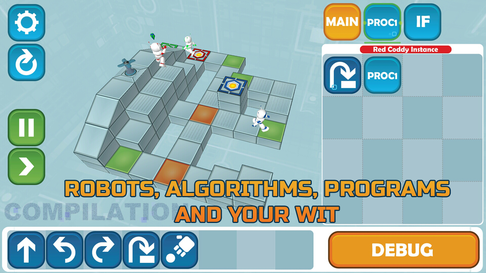
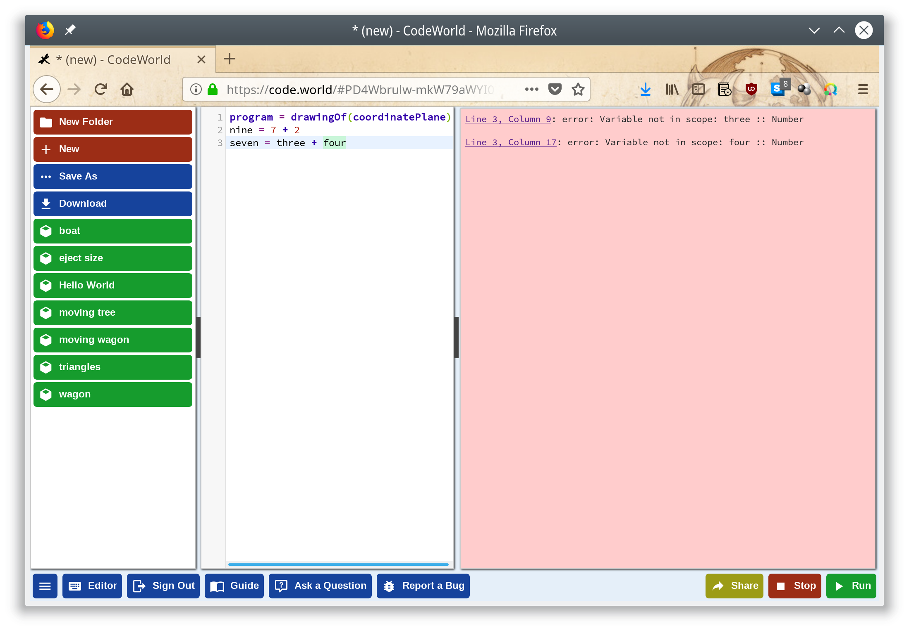

// Rendering : `bundle exec asciidoctor-revealjs -r asciidoctor-diagram cw-presentation.adoc`
// PDF : `bundle exec asciidoctor-pdf -a source-highlighter=coderay -r asciidoctor-diagram cw-presentation.adoc` 
// Serve : `ruby -run -e httpd . -p 5000 -b 0.0.0.0`
//
// Useful links : https://www.seas.upenn.edu/~cis194/fall16/lectures/01-intro.html


:revealjs_theme: serif
:source-highlighter: highlightjs

= CodeWorld


[NOTE.speaker]
--
Have local codeworld and haskell instances ready and logged in (chrome)

* s: speaker note view
* F11: navigator full screen
* Next tab : ctrl+tab
* WIN+p: mirror shortcut
--

== whoami

* backend developer @ Lizeo
* @pulsati0n

[NOTE.speaker]
--
rezulteo search engine : find a tyre that fits your car like a glove - using
a free search box and taking your driving style in account.

Anyway, Lizeo is much more than that : technical and commercial data analysis 
around tyres.
--

== What will be talked about

* "Traditional" tools
* Another approach
* How to use CodeWorld
* How CodeWorld works in the inside

== "Traditional" tools 

=== A long, long time ago

// possibilité d'utiliser http://robhagemans.github.io/pcbasic/

```basic
5 CLS
30 INPUT "How many stars do you want?"; NUMBER
40 FOR I = 1 TO NUMBER
50 STAR$ = STAR$ + "*"
55 NEXT I
60 PRINT STAR$
70 INPUT "Do you want more stars "; STAR$
80 IF LEN(STAR$) = 0 THEN GOTO 70
90 STAR$ = LEFT$(STAR$, 1)
100 IF (STAR$ = "Y") OR (STAR$ = "y") THEN GOTO 30
```

[NOTE.speaker]
--
This is an example from Wikipedia.
Line numbers emphasis the fact that this is a sequence of instructions.
`STAR$` is a variable that is reassinged : program execution depends on
its state.
This represents a certain vision of programming.
Each line is executed on after another, e.g. 
sequencially. Everything is based on mutability.
--

=== Today



// Exemple : scratch
// https://www.gameseducatekids.com/games/coddy_world_on_algorithm 

[NOTE.speaker]
--
Even though `goto` instruction has been replaced by teleporters, 
the principles remain the same - a sequencial execution of 
a set of instructions. (the robot represents an instruction pointer).
If computers execute assembly code this way, today
languages have evolved and instead of the vision that humans have
to adapt to machines, things can be the opposite.
--

// /!\ travailler le blabla (pourquoi les maths et pas autre chose)
=== Another approach

 * Use the functional paradigm
 * Evaluate functions instead of executing sequences of instructions
 * Avoid changing states and mutable data

[NOTE.speaker]
--
Because children are humans and not machines, it is possible to try
a different approach : instead of having your mind think just like
a machine - as they are better at it without doubt - why not express
our programs with something more human oriented? e.g. something 
nearer to mathematics.
--


// === Why mathematics
// Mathematics is the body of knowledge justified by deductive reasoning 
// about abstract structures, starting from axioms and definitions.
// 
// --
// Indeed, one of the authors' will is to bring some fun to maths,
// as today there are no really funny means to learn maths - 
// multiplications tables, etc are not indeed. 
// 
// Mathematics can be used to describe the natural world. 
// --

//  * Bring some fun to math

// [NOTE.speaker]
// --
// The original focus of code.world is math - 
// Much disciplines can be practiced with some fun, except mathematics. Why not?
// Why staying with multiplication tables?...
// --

// === Creative maths


// == Qu'est-ce-que c'est

// === Une plateforme pour apprendre à coder

// === Une question de principes
=== What it is

* Origin : Haskell for kids
* Math :
** Without any intermediary language
** Expressing creativity


[NOTE.speaker]
--
Indeed, one of the authors' will is to bring some fun to maths,
as today there are no really funny means to learn maths - 
multiplications tables, etc are not indeed, nor they are creative. 

He also insists on expressivity : some games like Coddy present
puzzles to be solved, but don't let much space for expressivity.
--

=== Humans are not machines

* Instead of pixels, use a 0-10 scale
* Definitions are not sequential, like in a dictionary
* Coordinate plane does not originate at the top left
* X axis is horizontal

[NOTE.speaker]
--
The number of pixels are hard to deal for young children.
In a dictionary, you wouldn't define words in the order
of their use. Therefore, you can use something defined 
at any place.
// Some of these implementation particularities prove here that
//we are dealing with something different.
// Why not take this opportunity to learn floating numbers?
In order to emphasise the fact that definitions are not sequential, 
the last element is displayed behind.
```haskell
program = drawingOf(coordinatePlane)
```
--


// === The coordinate plane
// image::images/codeworld-coordinate-plane.png[coordinate plane]
// [NOTE.speaker]
// --
// The CodeWorld coordinate plane is easier to work with for children.
// --

== How to use CodeWorld

// Image avec les différents panneaux : 
// * Editeur de texte (expliciter les possibilités)
// Canevas
// Fenêtre d'erreurs / warnings

=== How it looks like

image::images/codeworld-warning.png[warning,750,550]

[NOTE.speaker]
--
There are 3 main panels : on the left, a text editor.
On the upper right, a canvas that displays the program's
result. On the bottom right, information and error messages.

Another panels provide help (blue buttons). It is possible
to save programs, share them, and record videos.

Basic geometric shapes will be manipulated and transformed
in order to draw pictures.
--

=== How it looks like



=== Shape examples
* `circle(Number)`
* `rectangle(Number, Number)`
* `polygon([Point])`
* Solid shapes

[NOTE.speaker]
--
There are more shapes available indeed, but these
ones are enough for basic drawings.
// TODO: shapes example?
// TODO: travailler les polygones.
--

=== Transformation examples

* Add color
* move (translate)
* rotate
* dilate 
* combine (`&`)

[NOTE.speaker]
--
* colored :: (Picture, Color) -> Picture
* translated :: (Picture, Number, Number) -> Picture
* rotated :: (Picture, Number) -> Picture 
* dilated :: (Picture, Number) -> Picture

There are a few synonyms - for example, coloured and colored
both work, there's no problem if you're using british english :p
--

// TODO: === Example

=== Notions

* Expressions
* Definitions
* Functions
* Types

[NOTE.speaker]
--
Following are some basic notions to be used with CodeWorld.
They are going to be described in the following slides.
--

=== Expression

A combination of symbols, e.g. 
```haskell
7 + 2
x + 1
```

=== Definition

Giving a name to an expression, e.g.
```haskell
nine = 7 + 2
increment(x) = x + 1
```

[NOTE.speaker]
--
functions are indeed defined this way.
A function takes one or more parameters.
Giving values to these paramaters allow us
to apply it.
--

=== Analogies


[NOTE.speaker]
--
As an analogy, it can be viewed as a frying pan. 
The function's name, would be the pan's handle.
The parameters would be the ingredients you put
in it. After cooking (equivalent to applying the
function), you obtain a delicious dish :p

Also, a game you can play is imagining a function,
asking for input to your playmate, and tell him
the output : he has to guess what function it is.
You could even tell him if the type of some input 
elements is not correct :) 
For example : f(x) = x * 2 
wouldn't take "apricot" as an entry.
--

=== Type

What is being manipulated? What are we talking about?

```haskell
five :: Number = 5

alphaOmega :: Text
alphaOmega = "αω"

increment :: Number -> Number
increment(x) = x + 1
```

[NOTE.speaker]
--
For example in a dictionary, the type for each definition could be 
its "nature" (syntaxic role like adjective, noun, ...)

You can't create any type in CodeWorld.
--

=== Some available types

```haskell
program :: Program = drawingOf(lettering(helloWorld) 
                   & redTriangle)
height :: Number = 2
points :: [Point] = [(-1, 0), (1, 0), (0, height)]
triangle :: Picture = solidPolygon(points)
lightRed :: Color = RGB(1, 0.6, 0.6) 
redTriangle :: Picture = colored(triangle, lightRed)
helloWorld :: Text = "Hello, world!"
```

[NOTE.speaker]
--
Here is an example of a drawing.
All available types are described in the reference. Here are some examples.
Types are useful at least for documenting what is being manipulated.
The ampersand here means "and" or "in front of".
--

== Hands on

=== Drawing

```
program :: Program = drawingOf(wagon)
wagon :: Picture = wheels & container
container :: Picture = rectangle(5, 2)
wheel :: Picture = solidCircle(1)
rightWheel :: Picture = translated(wheel, 1.5, -1)
leftWheel :: Picture = translated(wheel, -1.5, -1)
wheels :: Picture = leftWheel & rightWheel
```  

=== Editor capabilities

* *Editor* button displays shortcuts
* Autocompletion (ctrl+space)
* Rainbow brackets

[NOTE.speaker]
--
* As children can have a hard time typing complex words,
autocompletion can be of great help.
* Rainbow brackets help to spot what closes what.
--
=== Animation

```
program :: Program = animationOf(movingWagon)
[...]
movingWagon(time) = translated(wagon, time, 0)
```  

=== Haskell

```haskell
import CodeWorld
main :: IO ()
main = drawingOf(wagon)
wagon :: Picture 
wagon = wheels & container
container :: Picture 
container = rectangle 5 2
wheel :: Picture
wheel = solidCircle 1
rightWheel :: Picture
rightWheel = translated 1.5 (-1.0) wheel  
leftWheel :: Picture
leftWheel = translated (-1.5) (-1.0) wheel  
wheels :: Picture 
wheels = leftWheel & rightWheel
```

[NOTE.speaker]
--
CodeWorld can also use haskell, it is possible 
to seamlessly move to a more "real" language.
Most language extensions are available. e.g.
```
{-# LANGUAGE UndecidableInstances #-}

```
--


== Debuging

* Coordinate plane
* Inspect mode
* Zooming 
* Time travel

[NOTE.speaker]
--
Coordinate plane can help to place objects in space.
--

=== Inspect mode

image::images/codeworld-debug-inspector.png[debug inspector,800,550]

[NOTE.speaker]
--
Inspect mode allows to navigate into the object hierarchy,
and displays their parameters.
--

=== Zooming

image::images/codeworld-debug-panel.png[debug panel,800,550]

[NOTE.speaker]
--
Sometimes, some objects are just out of reach. Changing
the point of view can help to debug them.
// TODO: c.f. https://medium.com/@krystal.maughan/breaking-the-space-time-barrier-with-haskell-time-traveling-and-debugging-in-codeworld-a-google-e87894dd43d7 
--

=== Time travel

// TODO: image
image::images/codeworld-debug-simulation.png[debug simulation]
[NOTE.speaker]
--
Available using `debugSimulationOf`
A simulation is an animation with a step "state" calculated from
the previous state and time delta.
The state can be a tuple of characteristics.
--

== How it works

* Codemirror : javascript text editor 
* Haskell API : vector graphics library inspired by Gloss
* Compiler : ghcjs executed on server

[ditaa,images/codeworld-architecture]
--
    +-----------------+   
    | CodeMirror cBLU |   
    +-----------------+    +-------------------+ 
    | Text editor     |    | Canvas cBLU       | 
    |                 |    +-------------------+
    |                 |    | Message area cBLU |
    +---+-------------+    +-------------+-----+ 
        |                                ^
        | XHR  +------------+ JavaScript |
        +----->+ GHCJS cBLU |------------+
               +------------+
               | Compiler   |
               +------------+
--

// TODO
[NOTE.speaker]
--
The code is sent to the server on which it is compiled using
`ghcjs`. Then, a hash is returned, and used to load and execute JS code.
--

== Conclusion

* Clean (no boilerplate)
* Simple enough
* Very well documented
* Common sense
* Instantly available
* Open source

[NOTE.speaker]
--
* Some alternatives such as reactive-turtle (Scala and Akka for kids)
are a bit cluttered for young minds in my opinion.
* Documentation covers almost everything and is easy to understand.
* This platform is opiniated, but in the right way imho.
--

=== Reactive turtle example

```scala
trait Shapes {
  type Shape = Seq[Command]
  def square(size: Int): Shape = {
      (1 to 4).flatMap(_ => Seq(Forward(size), Right(90)))
  }
  def spiral(size: Int): Shape = {
      (1 to 100).flatMap(a => Seq(Forward(size), Right(110 - a)))
  }
  def circle(size: Int): Shape = {
      (1 to 90).flatMap(a => Seq(Forward(size), Right(4)))
  }
}
```
[NOTE.speaker]
--
Explaining flatMap to a 6 years old child seemed a bit hard.
Another platform based on Scala though is Kojo, but a bit too
imperative to me (at least the turtle)
--

== Thanks

* https://code.world/ - Chris Smith
* SLUG
* scala.io
* You!

[NOTE.speaker]
--
My friends who let me discover functional programming.
C.D. smith created this world. Obviously there would be no presentation without him.
My colleagues who put me on this track. had the patience to listen to my digressions.
SLUG for letting me do a first attempt.
My familly who had the patience to let me time.
You for you time.
--

== Questions

== Extra

=== Going further

* Interacting with users
* Multiplayer games

// TODO

// * program = activityOf(initial, change, picture)
// * groupedActivityOf

[NOTE.speaker]
--
Interaction with users won't be covered here; examples in the official documentation.
--

=== extra

* Security
* Limitations

[NOTE.speaker]
--
Dangerous code (through some languages templates) is checked.
It seems that it's not possible to share core between different projects without copy/paste.
--

=== SDL coordinate system
image::images/sdl-coordinate-system.png[SDL coordinate system]
[NOTE.speaker]
--
This is an example of a "traditional" coordinate system, here SDL.
--

