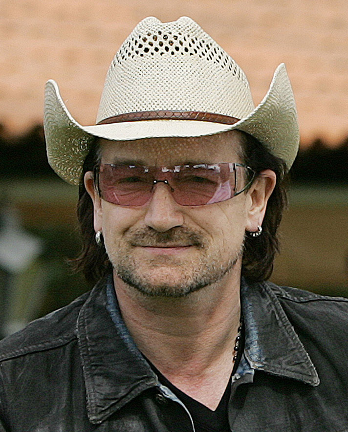
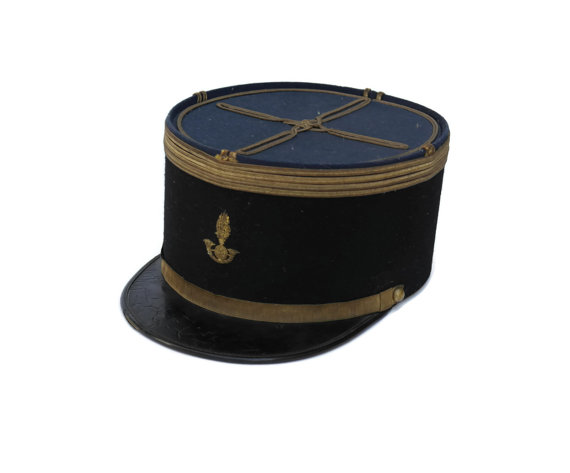
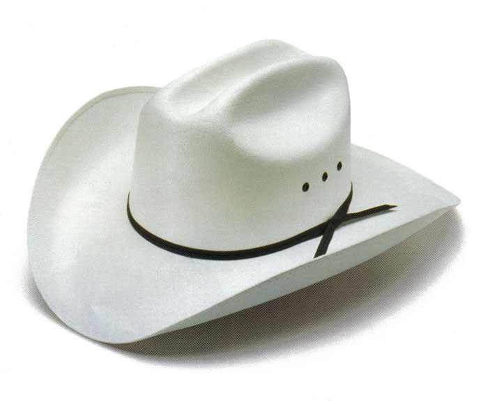
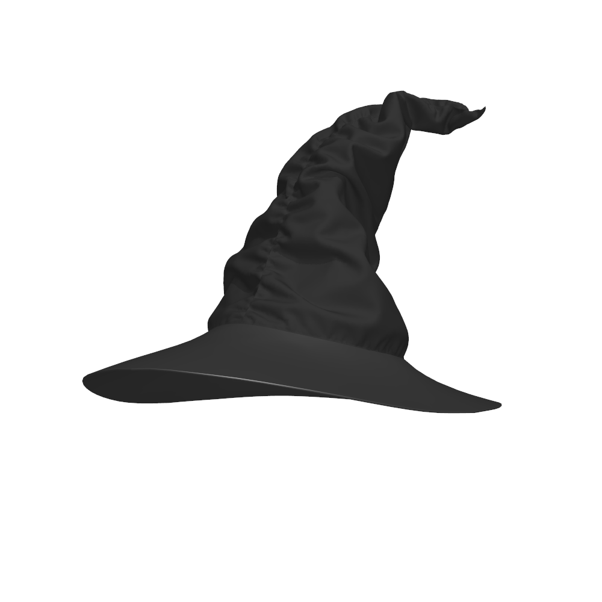
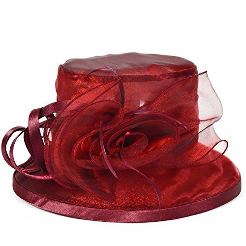
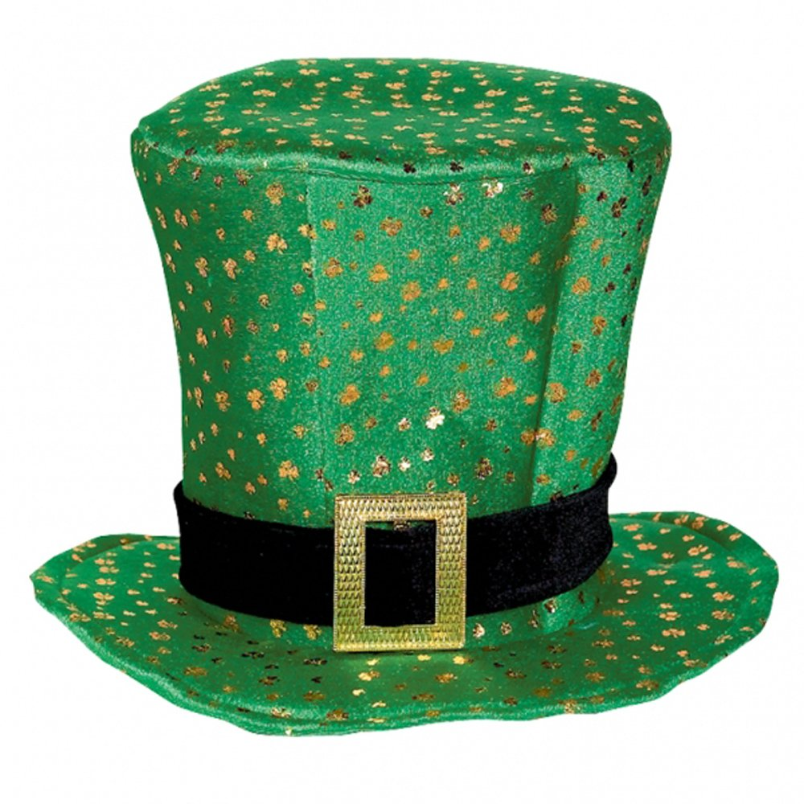

// Génération HTML :
// bundle exec asciidoctor-revealjs -a revealjsdir=https://cdnjs.cloudflare.com/ajax/libs/reveal.js/3.3.0 index.adoc

## Les chapeaux de Bono

## Présentation

### Origine

* Créé par Edward De Bono en 1985
* Adapté aux rétrospectives agiles vers 2009
* Implémentation de la théorie du "Parallel Thinking"

### Le Greek Gang of Three

* Au départ, le sophisme, école de la persuasion
* Le GGOT (Socrate, Platon, Aristote) : aller au delà de l'opinion
* La dialectique: confronter thèse et antithèse afin de produire une synthèse
* Le résultat de la confrontation se rapproche de la Vérité
* Selon De Bono, cette méthode est peu adaptée aux changements

### Les principes du Parallel Thinking

* La confrontation est nuisible à la créativité
* Par conséquent, éviter la confrontation systématique
* Séparer les modes de pensée
* Basculer d'un mode à l'autre
* Dans chaque mode, orienter les pensées dans le même sens

### Les objectifs

* Garder le focus
* Ne pas s'écarter du fil de la discussion
* Maîtriser la durée de la réunion
* Eviter que les discussions partent dans tous les sens
* En retirer des actions claires, concises et essentielles

### Comment?
* Choisir un facilitateur
* Diviser la rétrospective en plusieurs phases
* Chaque phase est symbolisée par un chapeau
* Chaque chapeau représente un état d'esprit ou un point de vue qui permet de cadrer la discussion
* Le facilitateur fait appliquer les limites de temps
* Le facilitateur liste les différents éléments qui ont été évoqués

<<<

## Les chapeaux

<<<

### Le chapeau bleu

_Environ 5 minutes (départ) + 5 minutes (fin)_

### Un méta-chapeau

* Gérer la réunion
* Au départ:
** Indiquer l'objectif et le sujet de la rétrospective
** Organiser et expliquer les règles
* A la fin:
** Lire les actions et s'assurer qu'elles ont un auteur et une date butoir
** Demander un retour sur la rétrospective
** Partager les notes avec l'équipe (e-mail, wiki, ...)

<<<

### Le chapeau blanc

_Environ 10 minutes_

### Faits et chiffres uniquement

* Pour l'instant, ne pas faire part de ses sentiments
* Ne pas porter de jugement
* Ne pas évoquer d'aspect positif ou négatif

### Par exemple

* 5 stories ont été terminées
* 2 stories n'ont pas été terminées
* Chaque déploiement a pris 2 heures
* 2 personnes étaient en vacances

<<<

### Le chapeau noir

_Environ 15 minutes_

### Esprit critique

* Evoquer les pensées négatives
* Rester courtois, garder la maîtrise de ses émotions
* Pour l'instant, ne pas parler des solutions

### Pistes

* Qu'est ce qui s'est mal passé?
* Quels ont été les soucis de communication?
* Qu'est ce qui vous a tapé sur les nerfs?

<<<

### Le chapeau jaune

_Environ 10 minutes_

###  Esprit constructif

* Mettre en valeur les éléments positifs
* Commémorer les les victoires, même si elles sont modestes

### Pistes

* Quelles sont les actions menées dont vous avez tiré le plus de satisfaction?
* Qu'avez-vous appris?
* Qu'est ce qui s'est mieux passé que prévu?

<<<

### Le chapeau rouge

_2 minutes par personne maximum_

### Sentiments et émotions

* Chaque participant peut prendre le temps d'exprimer ses sentiments vis à vis du sujet de la rétrospective
* *Pas de prise de note* - tout doit rester entre les participants
* Pas de débats
* Pas de jugements
* Pas d'interruptions
* Remercier chaque participant d'avoir partagé ce moment, puis passer à autre chose

<<<

### Le chapeau vert

_Environ 15 minutes_

### Résolution constructive de problèmes

* Créativité, pensées spontanées, inspiration
* Comment améliorer les choses dans le futur
* Planifier des actions

### Pistes

* Comment améliorer cet élément?
* Comment éviter cet autre élément?
* Et si on reprenait à zéro celui-là?

<<<

## Pour aller plus loin

// chapeau gris : http://schoolofthinking.org/2007/10/the-seventh-hat-for-wisdom/
* Les chapeaux de Bono s'apparentent à la catégorisation des modes de pensée
* L'analyse transactionnelle
** Orientée vers la communication
** Déclinaisons des modes de pensée enfant, adulte, parent
// TODO: * Chacun un chapeau différent?

// : http://www.njdiaries.com/2016/12/09/transactional-analysis-eric-berne/

## Questions

### Crédits

source: http://fr.slideshare.net/rafaelrosafu/6-thinking-hats-for-retrospectives
